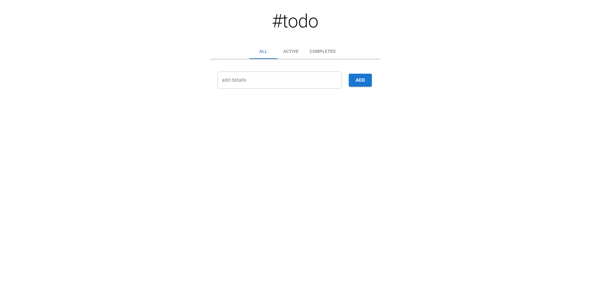

<!-- Please update value in the {}  -->

<h1 align="center">#todo</h1>

<div align="center">
   Solution for a challenge from <a href="http://devchallenges.io" target="_blank">Devchallenges.io</a>.
</div>

<div align="center">
  <h3>
    <a href="https://app-react-todo-list.netlify.app/">
      Demo
    </a>
    <span> | </span>
    <a href="https://github.com/jjrock36/react-todo">
      Solution
    </a>
    <span> | </span>
    <a href="https://devchallenges.io/challenges/hH6PbOHBdPm6otzw2De5">
      Challenge
    </a>
  </h3>
</div>

<!-- TABLE OF CONTENTS -->

## Table of Contents

- [Overview](#overview)
- [Built With](#built-with)
- [Features](#features)
- [How to use](#how-to-use)
- [Contact](#contact)
- [Acknowledgements](#acknowledgements)

<!-- OVERVIEW -->

## Overview



### Built With

<!-- This section should list any major frameworks that you built your project using. Here are a few examples.-->

- [React](https://reactjs.org/)
- [MaterialUI](https://mui.com/)

## Features

<!-- List the features of your application or follow the template. Don't share the figma file here :) -->

This application/site was created as a submission to a [DevChallenges](https://devchallenges.io/challenges) challenge. The [challenge](https://devchallenges.io/challenges/hH6PbOHBdPm6otzw2De5) was to build an application to complete the given user stories.

## How To Use

<!-- This is an example, please update according to your application -->

To clone and run this application, you'll need [Git](https://git-scm.com) and [Node.js](https://nodejs.org/en/download/) (which comes with [npm](http://npmjs.com)) installed on your computer. From your command line:

```bash
# Clone this repository
$ git clone https://github.com/jjrock36/react-todo.git

# Install dependencies
$ npm install

# Run the app
$ npm start
```

## Acknowledgements

<!-- This section should list any articles or add-ons/plugins that helps you to complete the project. This is optional but it will help you in the future. For exmpale -->

- [React CRUD App Tutorial](https://www.freecodecamp.org/news/react-crud-app-how-to-create-a-book-management-app-from-scratch/)
- [MUI](https://mui.com/)
- [How to Work with Multiple Checkboxes](https://www.freecodecamp.org/news/how-to-work-with-multiple-checkboxes-in-react/)
- [Material UI Tabs Component with React Router](https://www.youtube.com/watch?v=mhjbACbSeSU)

## Contact

- Website [joeyjenson.com](https://joeyjenson.com/)
- GitHub [@jjrock36](https://github.com/jjrock36)
